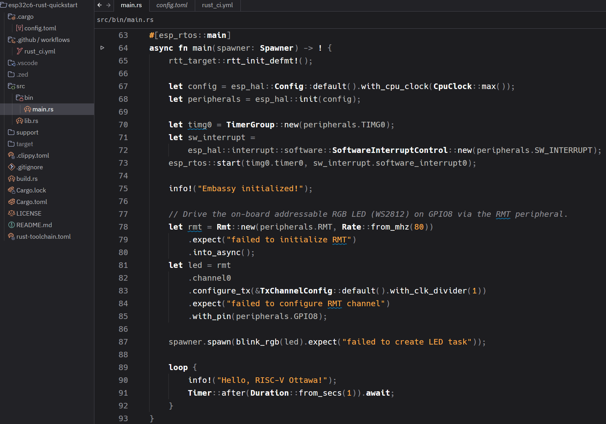
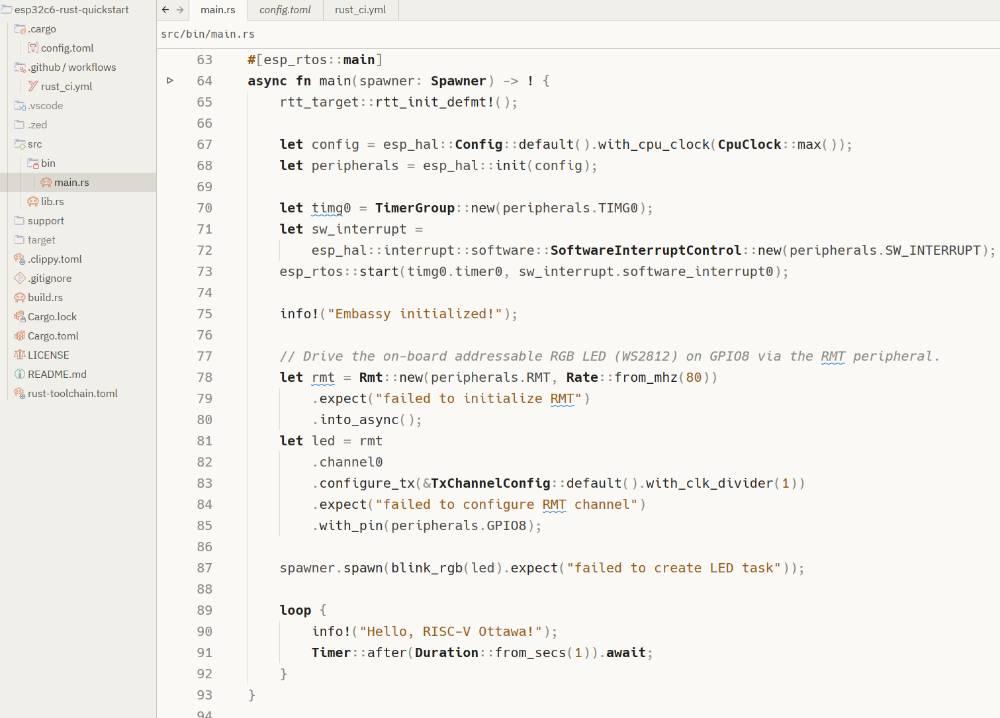

# Monochrome Amber Zed Theme

A theme for [Zed](https://zed.dev) with a mostly-monochrome palette and warm amber accents,
available in dark and light variants (**Monochrome Amber Dark** and **Monochrome Amber Light**).
Adapted by Yusef Karim from the original Monochromator theme(s) by Josias Beem.

The font shown in the screenshots is [Hack](https://sourcefoundry.org/hack/).





## Install

Once published, open the command palette in Zed, run `zed: extensions`, search
for **Monochrome Amber**, and install. Then select it via
`theme selector: toggle`.

## Develop locally

To try it before publishing, run `zed: install dev extension` from the command
palette and point it at this directory. Zed will load the theme directly.

## Publishing as an official Zed extension

Extensions live in the [`zed-industries/extensions`](https://github.com/zed-industries/extensions)
registry. To submit:

1. Push this directory to its own public GitHub repository.
2. Fork `zed-industries/extensions` and clone your fork.
3. Add your repo as a git submodule under `extensions/`:
   ```
   git submodule add https://github.com/yusefkarim/zed-monochrome-amber \
     extensions/monochrome-amber-theme
   ```
4. Add an entry to the top-level `extensions.toml`:
   ```toml
   [monochrome-amber-theme]
   submodule = "extensions/monochrome-amber-theme"
   version = "0.1.0"
   ```
5. Run `pnpm sort-extensions` to keep `extensions.toml` and `.gitmodules` ordered.
6. Open a pull request. Once merged, the extension is built automatically and
   appears in Zed's extension registry for anyone to install.

Bump `version` in both `extension.toml` and the registry's `extensions.toml`
whenever you publish an update.
